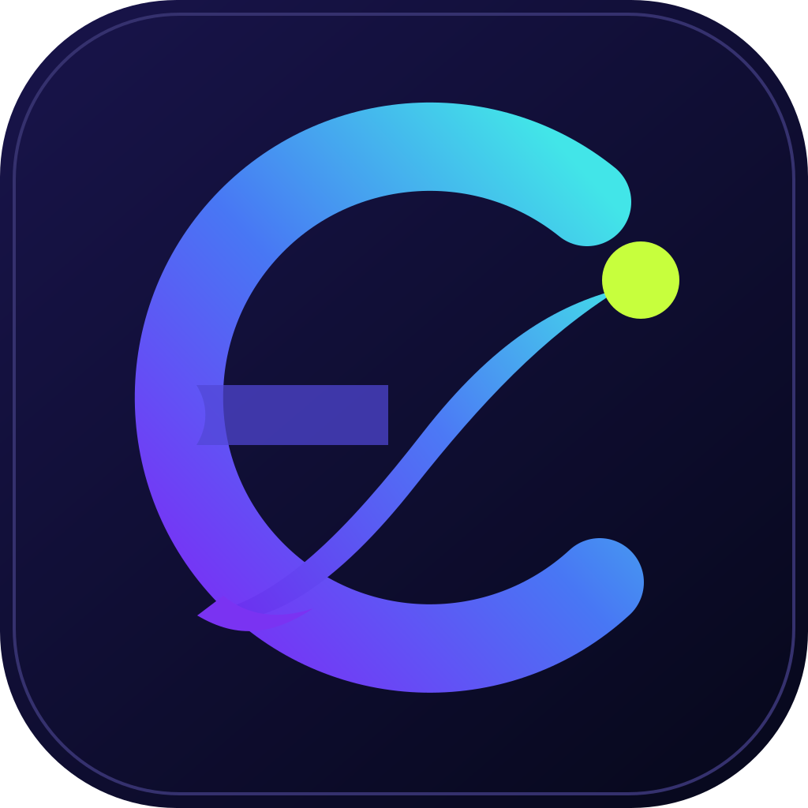

<div align="center">
  

<h1>DHQClash Router</h1>

<p>
  Клиентская панель защищённой маршрутизации для роутеров Keenetic/Netzraze.
  Единый интерфейс с сайтом и приложениями DHQClash.
</p>
  


</div>
<br>  
  
## ✨ Особенности

- 🚀 Установка одной командой
- 📉 Низкое потребление ресурсов
- ⛔ Никаких зависимостей кроме XKeen
- 🔐 Обязательный пароль администратора при первом запуске
- 🧭 Простая главная и отдельный расширенный режим
- 🌐 Отдельная сборка Mihomo `external-ui`
- ⚓️ Порт по умолчанию: 1000 (меняется в `/opt/etc/init.d/S99xkeen-ui`)
- 🎛️ Управление сервисом: `/opt/etc/init.d/S99xkeen-ui start|restart|stop|status`

&nbsp;

## ⚙️ Функционал

- 📊 Мониторинг и управление сервисом
- 📝 Редактирование конфигураций с валидацией и форматированием
- 📜 Просмотр логов с автообновлением и фильтрацией
- 🕒 Выбор часового пояса в логах
- 🔀 Переключение/установка/обновление ядер Xray и Mihomo
- 🔗 Генерация аутбаундов из ссылок (также доступно [отдельно по ссылке](https://zxc-rv.github.io/XKeen-UI/Outbound_Generator/))
- 🩻 Сканирование dat файлов
- ⚔️ Clash API реализация для Mihomo
- 🎛️ DHQClash external-ui: маршрутизация, соединения, правила и логи

&nbsp;

## ⚡️ Быстрый старт (установка/обновление/удаление)

Полная пошаговая инструкция, включая Entware, Mihomo `external-ui`, безопасность и диагностику: [INSTALL_ENTWARE.md](INSTALL_ENTWARE.md).

### Cтабильная/Latest версия

```SH
curl -fL https://raw.githubusercontent.com/dashqee/DHQ-XKeen-UI/main/setup.sh | sh
```

### Бета/Pre-release версия

```SH
curl -fL https://raw.githubusercontent.com/dashqee/DHQ-XKeen-UI/main/setup.sh | sh -s -- beta
```

<br>

## 🌐 Доступ извне

Панель разработана для работы в локальной сети. В случае необходимости использовать панель за пределами локальной сети рекомендуется использовать VPN протоколы, такие как SSTP или Wireguard.
Также поддерживается работа с KeenDNS, для этого нужно в веб-конфигураторе создать саб-домен с протоколом HTTP и портом панели. Авторизация включена по умолчанию, но публичный доступ всё равно должен быть закрыт VPN или дополнительным reverse proxy.
> [!CAUTION]
> Открытие доступа к панели из интернета без должных мер безопасности может привести к взлому роутера или утечке данных.
> За данные последствия автор проекта ответственность не несет.
<br>
  
## 🙏 Благодарности

- [**zxc-rv/XKeen-UI**](https://github.com/zxc-rv/XKeen-UI) — исходный проект панели
- [**Skrill0/XKeen**](https://github.com/Skrill0/XKeen)  
- [**jameszeroX/XKeen**](https://github.com/jameszeroX/XKeen)  
- [**Anonym-tsk/nfqws-keenetic**](https://github.com/Anonym-tsk/nfqws-keenetic)

## ⚖️ Лицензирование

В исходном репозитории XKeen-UI не обнаружен файл лицензии. До публичного или коммерческого распространения DHQClash Router необходимо получить явное разрешение правообладателя либо подтверждение применимой лицензии.
